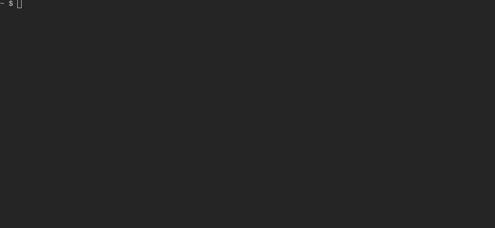

# Terminal Attribute Table (tat)

For inspecting geospatial data in the terminal.



## Motivation

Working with geospatial data and using a terminal environment a lot there are some situations
where I find that being able to quickly and _interactively_ inspect attribute data would be useful.
Of course you can use something like `ogrinfo` (or `gdal vector info` nowadays, or even
`ogrinfo <uri> | less` for some interactivity) these are not quite the type of TUI I found myself
wishing for.

I also wanted to try out Rust, so creating this type of terminal attribute table felt like a good
way to learn while also producing a tool that I could see myself actually using and not just leaving
it as an abandoned learning project.

## Install

> [!NOTE]
> The program is in an early state and has not been thoroughly tested.

Currently has been confirmed to work on Linux. Windows (non-WSL) is not (currently) supported.
I do not have the ability to test on macOS.

Currently the only option is to use Cargo to install directly from GitHub.
Cargo needs to be [installed first (alongside Rust)](https://doc.rust-lang.org/cargo/getting-started/installation.html).

```shell
cargo install --git https://github.com/JuhoErvasti/tat
```

Same command can be used to update.

## Usage

```shell
# files
tat example.gpkg
tat example.shp

# ogr URI
tat PG:service=SERVICE
```

GDAL is used under the hood, so any GDAL-supported vector driver should theoretically work if
you use a correct URI.

> [!NOTE]
> The program is in an early state and has not been tested with all vector drivers thoroughly.
> Some drivers (such as WFS) are known to work quite slowly.

## Roadmap

This is purely a hobby project so development is intermittent and absolutely not guaranteed.
Since this is and likely will remain a single-author repository I'm also using this section
basically as project management because creating and managing issues feels clunky and unnecessary
without any collaborators.

For the first proper version the following are still under development:

- Tests and CI

Further features I've considered for future versions:

<details>
<summary>More details</summary>

  Most important:
  - Optimize performance
    - Some drivers such as CSV and WFS are slow even with a fairly small number of features

  Maybe:
  - More mouse support, such as:
    - Opening layers
    - Selecting cells
    - Copying cell values (Right/Middle click or something?)
  - Preserve table state for each layer instead of resetting it every time when closing layer
  - Some support for looking at raster metadata similar to `gdalinfo` (not displaying raster itself)
  - Allow viewing/copying geometry as WKB in addition to WKT
  - Ability to select a whole feature in the attribute table
    - (Maybe) allow selecting multiple features?
    - (Maybe) copy it/them as GeoJSON/GML(?)
  - Allow exporting dataset as a GeoPackage
    - (Maybe) as any ogr-supported driver?
    - (Maybe) allow selecting which layers are exported?
    - (Maybe) if selecting features are implemented, export only those features?
  - Allow setting a spatial filter on a dataset

  Unlikely:
  - Raster attribute tables
  - Some way of displaying geometries as other whan WKT
    - Probably best bet would be to render the geometry as a temporary image and display it using [viuer](https://github.com/atanunq/viuer)

  Extremely unlikely:
  - Editing of any kind, the main impetus for developing this tool is to just inspect data
</details>
