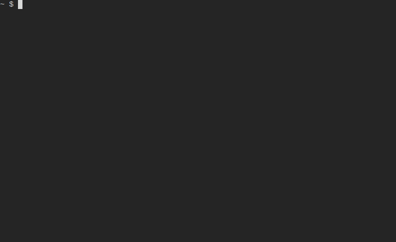

# Terminal Attribute Table (tat)

For inspecting geospatial data in the terminal.



## Motivation

Working with geospatial data and using a terminal environment a lot there are some situations
where I find that being able to quickly and _interactively_ inspect attribute data can be useful.
Of course you can use something like `ogrinfo` (or `gdal vector info` nowadays, or even
`ogrinfo <uri> | less` for some interactivity) these are not quite the type of TUI I found myself
wishing for.

I also wanted to try out Rust, so creating this type of terminal attribute table felt like a good
way to learn while also producing a tool that I could see myself actually using and not just leaving
it as an abandoned learning project.

## Install

> [!NOTE]
> The program is in an early state and has not been thoroughly tested.

Currently tested only on Linux. Windows is confirmed to be currently not supported. I do not have the
ability to test on macOS.

Currently the only option is to use Cargo to install directly from GitHub.
Cargo needs to be [installed first (alongside Rust)](https://doc.rust-lang.org/cargo/getting-started/installation.html).

```shell
cargo install --git https://github.com/JuhoErvasti/tat
```

Same command can be used to update.

## Usage

```shell
# files
tat example.gpkg
tat example.shp

# ogr URI
tat PG:service=SERVICE
```

GDAL is used under the hood, so any ogr-supported vector driver should theoretically work if
you use an OGR-supported URI.

> [!NOTE]
> The program is in an early state and has not been tested with all file formats etc. thoroughly.
> Some drivers (such as WFS) are known to work quite slowly.

## Roadmap

This is purely a hobby project so development is intermittent and absolutely not guaranteed.
Since this is and is likely to remain a single-author repository I'm also using this section
basically as project management because creating and managing issues feels clunky and unnecessary
without any collaborators.

However, here are the features I would like to add (more or less in order of importance):

- Unit tests
- Distinguish the "Feature" column more clearly
- Display geometry column(s) as WKT
- Jumping to specific FID
  - (Maybe) jumping to specific cell?
- Allow inspecting long attributes better, maybe in a pop-up
- Allow copying value from cell
  - (Maybe) allow copying geometry as WKB in addition to WKT?
- Allow browsing the dataset / layerinfo blocks if the text overflows
- Mouse support: scrolling the table with mouse wheel
- Visual polish
- Pre-calculate and cache layer feature counts asynchronously to speed up opening layers with a lot of features
- Optimize performance with certain data drivers
- Mouse support other than scrolling, such as (?):
  - Opening layers
  - Selecting cells
  - Copying cell values

Unlikely (nice-to-haves):
- Raster attribute tables?
  - Also maybe some support for looking at raster metadata (similar to `gdalinfo`)?

Not going to do:
- Editing of any kind, the purpose of this tool is purely to inspect the data

<details>
<summary>Completed</summary>

- Fix issues with some layers not opening in the table
- Improve performance on large layers (only render what can be seen)
  - Improve performance on opening large layers
- Fit columns differently so not all are crammed into the table, instead allow browsing them
- Show FID in table
  - Fix issue with the bottom-most rows not showing
- Fix issue when attempting navigation on an empty layer
- Fix issue "Error browsing database for PostGIS Raster tables" when attempting to open with PostGIS driver
- Fix weird issue with shapefile not being correctly read and (probably?) stderr output from gdal being printed all over the place
  - The worst of it is fixed by setting an error handler for gdal, which currently does nothing special. This is obviously not the best solution,
  maybe we collect the errors and add a pop-up widget to show a log of them or something like that?
- Show scrollbars for the layer list and the table
  - Also a scrollbar for the columns. Or some other visual indicator when not every column is shown

</details>
